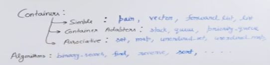

- set is a key collection
- map is like dictionary in python

- unordered means hashtable that means when you traverse no order 
- odered is opposite

```
sort(arr,arr+n);
binary-search(arr,arr+n);
```