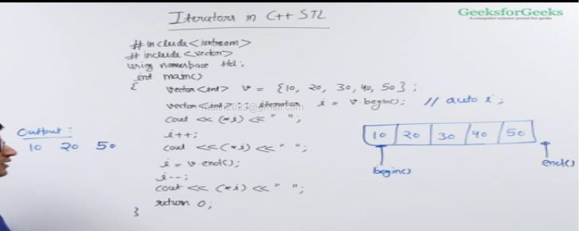

- iterator gives address of an element in c++

- iterators are not pointers there are some iterators that can be treated as pointers but many iterators can't be treated like pointers for example forward list iterator.

- end() iterator points to the memory location just next to the last element

