deque is doubly ended queue

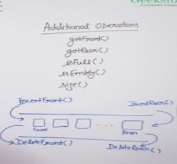

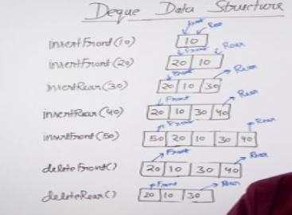

## Implementation

### Linked List - doubly linked list

### Array - circular array with front and rear indexes

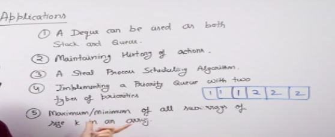

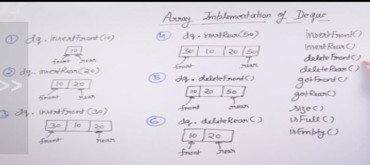

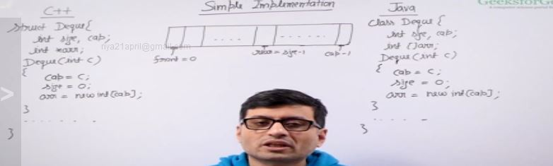

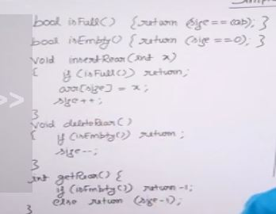

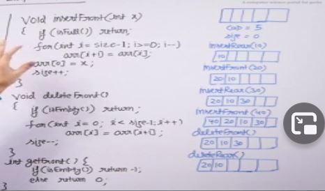

Here its not efficient because front operation is O(n)

Efficient implemention is when we treat array as circular

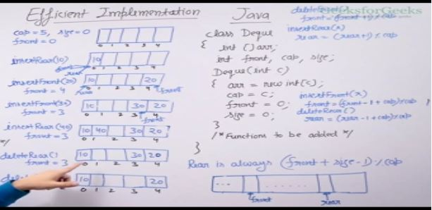

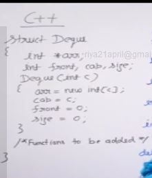

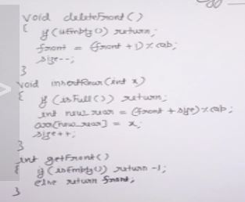

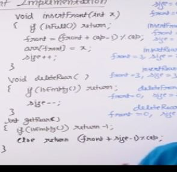

Example -

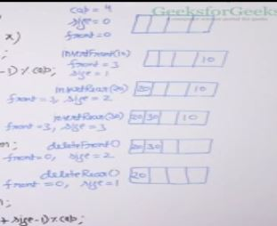