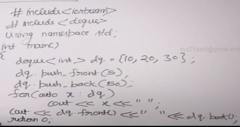
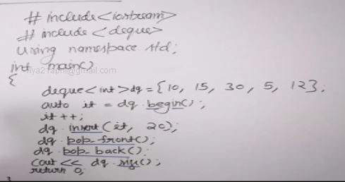
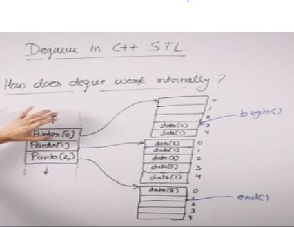
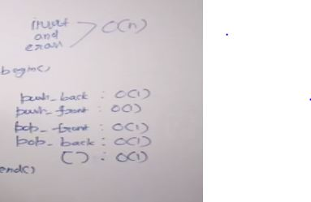
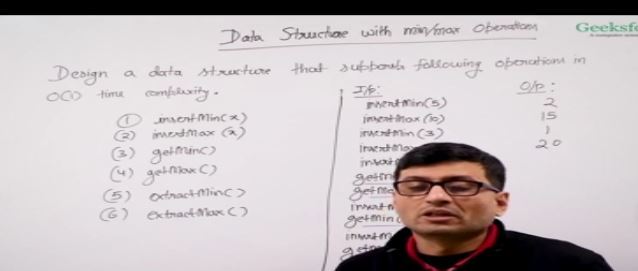
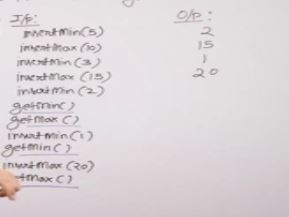
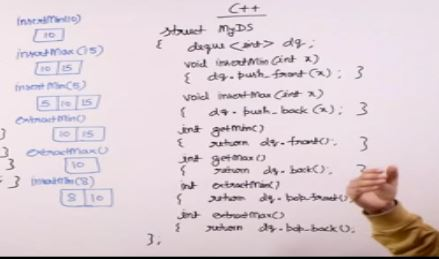

deque is doubly ended queue

## Implementation

### Linked List - doubly linked list

### Array - circular array with front and rear indexes

Here its not efficient because front operation is O(n)

Efficient implemention is when we treat array as circular

Example -

## Deque in c++ stl

- begin returns pointer to the first element and end beyond the last element
- cbegin and cend are const iterators can't change any element using this iterators
- rbegin and rend are reverse iterators , rbegin points to the last element and rend points to the element just before the first element.
- crbegin and crend const version of rbegin and rend
- insert inserts the element before the iterator.
- size how many elements in deque
- constant time means that the time is constant wrt to the copy constructor calls

## Design a Data Structure with Min and Max operations

Constraint we only insert anything anything which is greater than max and smaller than min.The element should be eiyher greater than all the elements or smaller than all the elements.

We can do it using deque maintaining min at the front end and max at the rear end.

