# Tree Data Structure

Tree Data Structure is used to organise data in hierarchical manner.
In this video we discuss about:
node,root,leaf,child,parent,subtree,descendants,ancestors,degree and internal nodes.

tree stores in hirarchial

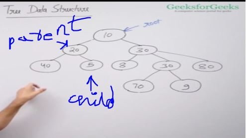

tree are reccursive with subtree

descendent are the leaf nodes under a parent/root node

tree nodes which have degree 0 are leaf nodes and all other are internal nodes.

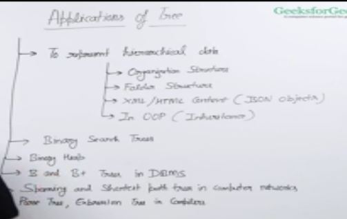

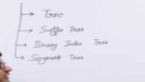

## Binary Tree

In Binary Tree every node has at most two children.

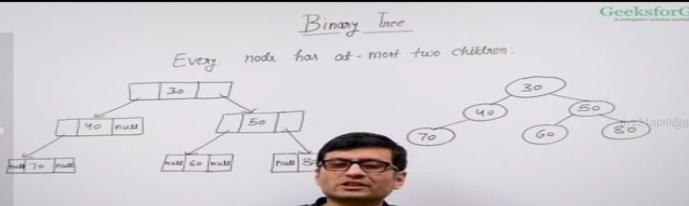

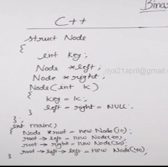

## Tree Traversal

Tree Traversal is basically going through every node(key) exactly once.

Types of Tree Traversal i.e. Breadth-First Search(BFS) and Depth First Search(DFS).

Inorder, preorder and postorder traversals they are permutations of DFS , as we can visit subtrees in any order.

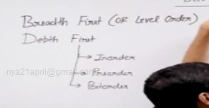

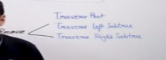

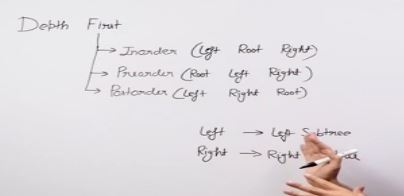

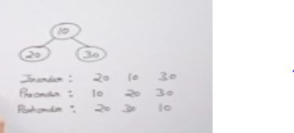

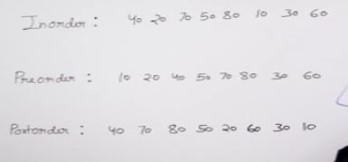

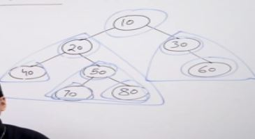

## Implementation of Inorder Traversal

Implementation of Inorder Traversal
In this video, we discuss a function that takes root as a parameter, whose return type is void and is supposed to print inorder traversal of the Tree whose nodes are given.

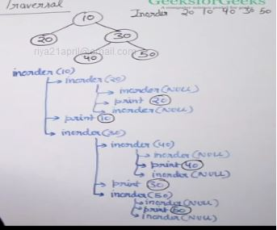

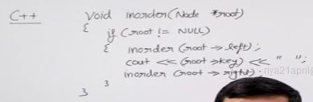

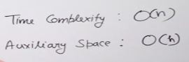

## Implementation of Preorder Traversal

Implementation of Preorder Traversal
In this video, we discuss a function that takes root as a parameter, whose return type is void and is supposed to print Preorder traversal of the Tree whose nodes are given.

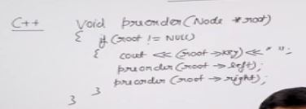

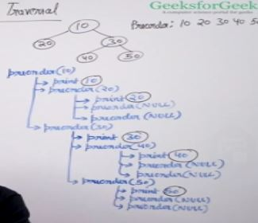

same as inorder

## Implementation of Postorder Traversal

Implementation of Postorder Traversal
In this video, we discuss a function that takes root as a parameter, whose return type is void and is supposed to print Postorder traversal of the Tree whose nodes are given.

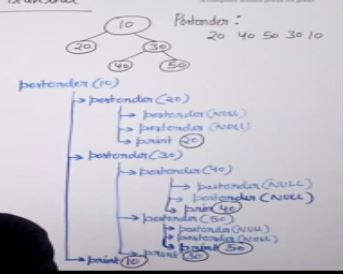

same as above two

## Height of Binary Tree

Height of Binary Tree is the number of nodes between the longest path from root to leaf node(including the root and leaf node).
In this video we discuss about a recursive function that takes root of the tree and returns the height of the Binary Tree.

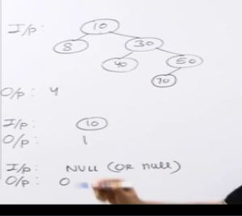

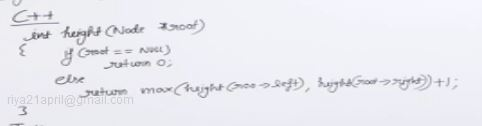

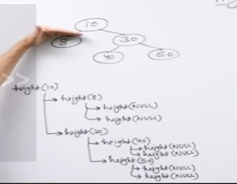

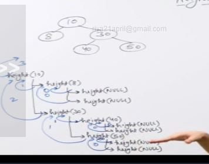

## Print Nodes at K distance

Nodes at distance k from the root are basically the nodes at (k+1)th level of the Binary Tree.
In this video, we discuss a function that takes root and k as a parameter, whose return type is void and is supposed to print the nodes at distance k from the root.

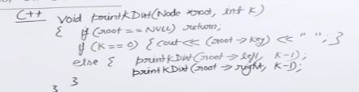

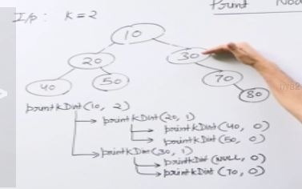

time complexity : O(n)

Auxillary space : O(h)

h: height of binary tree

## Level Order Traversal

Level order traversal of a tree is breadth first traversal of binary tree.
In this video we will discuss about a function that takes root as a parameter, doesn’t returns anything and prints the level order traversal in a single line.we implement this function using queue datastructure.

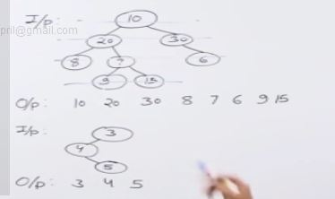

We will use queue data structure here recursion is not a good idea

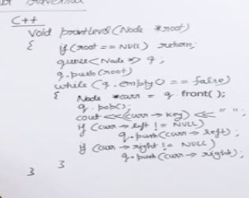

## Level Order Traversal

Level order traversal of a tree is breadth first traversal of binary tree.
In this video we will discuss about a function that takes root as a parameter, doesn’t returns anything and prints the level order traversal in a single line.we implement this function using queue datastructure.

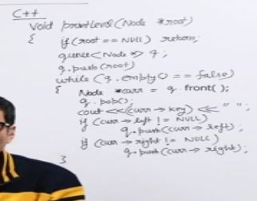

root then we take out the root and insert its children then children and queue is formed.

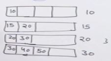

enque and deque is O(1)

auxillary space is width of the binary tree

theta means average

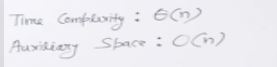

or theta(w) auxillary space where w is width

## Size of Binary Tree

Size of Binary Tree is the total numbers of nodes present in that Tree.
In this video, we discuss a recursive function that takes root as a parameter and is supposed to return the size of the Tree whose nodes are given.

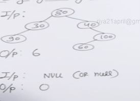

### Recursive technique

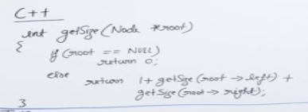

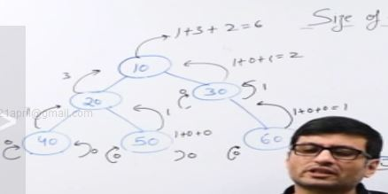

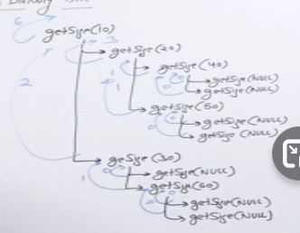

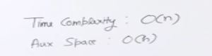

auxillary space is because recursive call stack.

Can also do it with iterative using level order traversal.

## Maximum in Binary Tree

Largest node(key) in a Tree is the maximum of the Tree.
In this video, we discuss a recursive function that takes the root of a binary Tree and returns the maximum of the Tree.

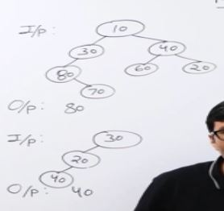

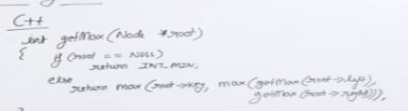

time complxity - O(n)

auxillary space - O(h) h is height of tree

can do it with queue too

if tree is skewed that means like a plain vertical tree then recursive one is bad as it will have all nodes in its stack , and vise versa

## Iterative Inorder Traversal

LIFO

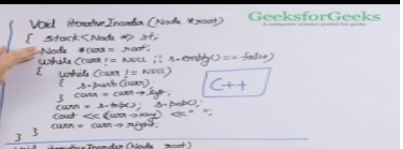

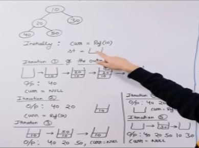

go left left left and as we pop we add the right side in the stack.

We exactly push one item once in the stack and pop once from the stack so time complexity is O(n) -> pushing and poping is O(1)

space -O(h)

## Iterative Preorder Traversal (Simple)

A O(n) extra space and O(n) time solution

LIFO

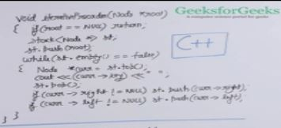

## Iterative Preorder Traversal (Space Optimized)

A O(h) extra space and O(n) time solution

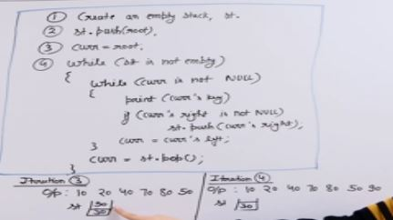

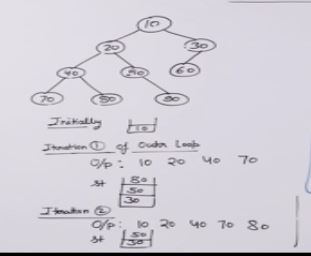

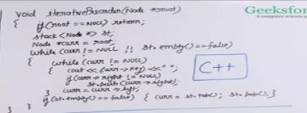

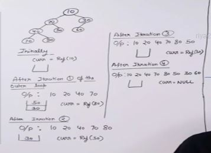