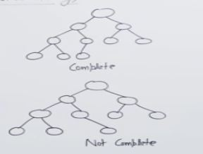

- For a binary tree to be complete two condition should be satisfied.
    - All levels should have the maximum number of nodes it can have except for the last level.
    - All nodes should be from left to right there shouldn't be any gap. 

- Why do we want to have a binary heap as complete?
    - Its because we want to store it as a array

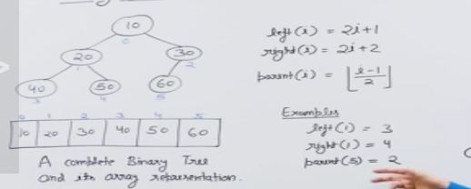

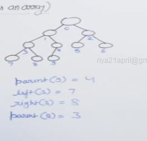

- We can find the indexes of the array and heap relation.

- Advantages of storing in the array
    - Contiguous memory location
    - Cache friendly
    - Its a complete binary tree then we have minimum possible height
    - Random access.
    - Meomory Efficient.

## Min Heap.

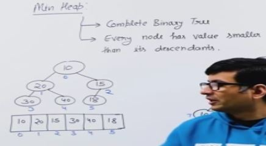

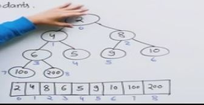

## Binary Heap Implementation

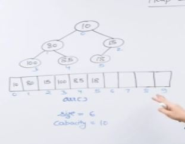

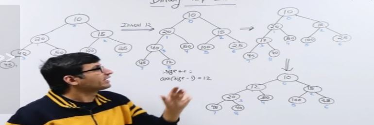

- How Insert in min heap works?
    - We first insert it in the last node or the end of the array.
    - And we slowly move up the heap.
    - We compare the newly inserted element with its parent , if the parent is greater than the newly inserted elemnt we swap the both.
    - We continue this and stop when the current leaf is smaller than the new leaf or the root leaf is reached.

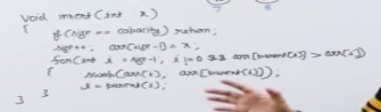

Time complexity is O(h)

## Binary Heap (Heapify and Extract)

### Heapify

Take a tree and make it into a heap.
Check for only the element given , it may or may not violate heap condition. If no condition violated no need to do anything.

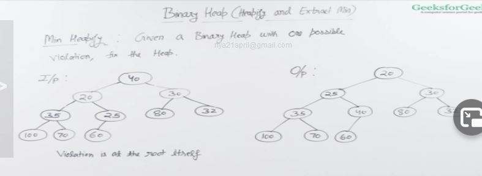

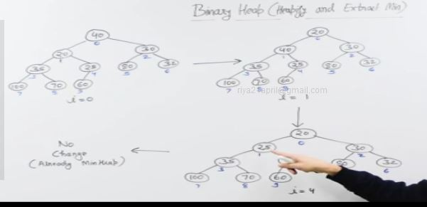

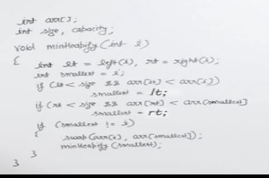

Time complexity - O(h)
Space - O(h)

### Extract

Remove the minimum element.

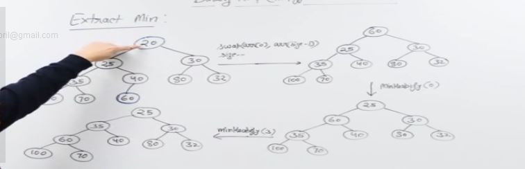

- Place the last element in the first elements place 
- call heapify for the current first element 

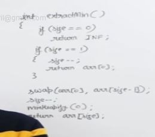

Time Complexity = Space = O(logn)

## Binary Heap (Decrease Key, Delete and Build Heap)

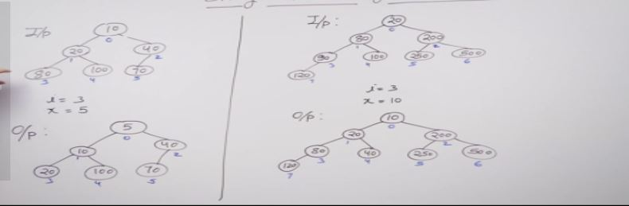

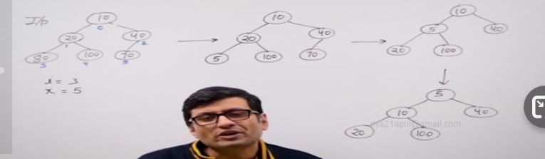

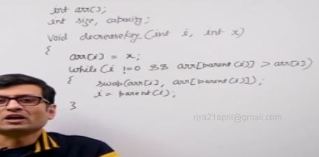

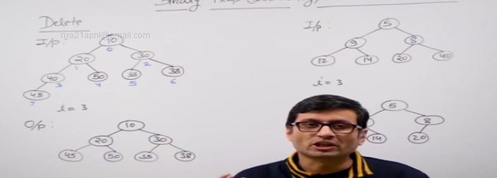

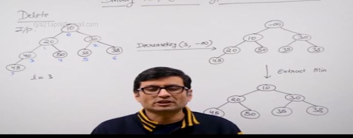

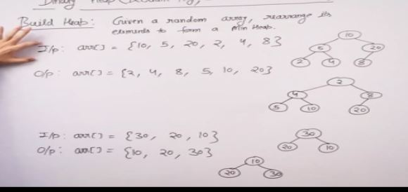

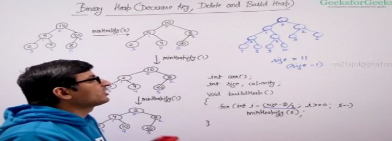

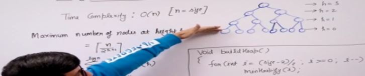

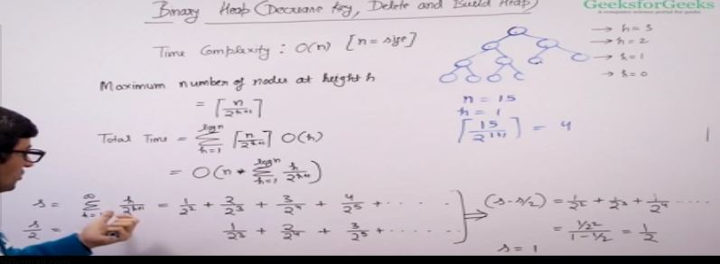