## Sort in c++ stl

Sort is mainly used in containers which allows random access eg..,arr,vectors,deque

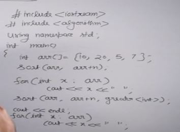

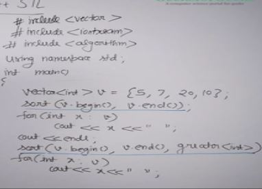

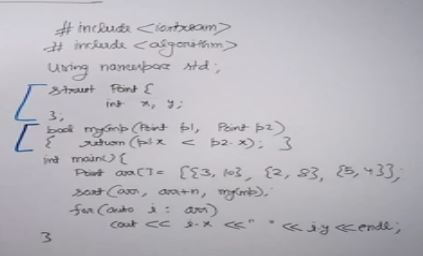

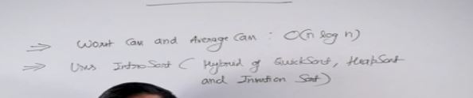

## Stability in Sorting Algorithm

A stable sorting algo not only sorts the array it also ensures that the elements are sorted according to the original order if they have the same value.

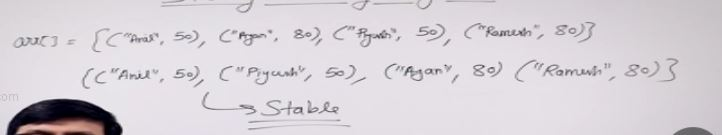

In this example the array of pairs is sorted according to the second element but notice that Anit and Piyush has same second value But Anil is places first because it appears first in the original array.

Stability is not that imp if you are sorting an integer array.But its usefull when there are many fields.

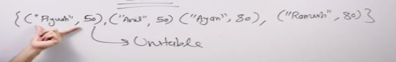

## Bubble Sort - Compares arr[i] with arr[i+1]

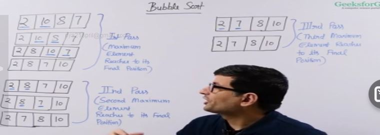

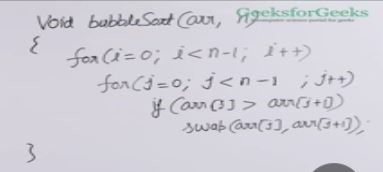

#### Optimizatization 

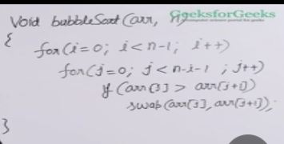

The idea is that we always have the last ith elements sorted and largest so everytime we don't have to check till the end.

#### Time Complexity

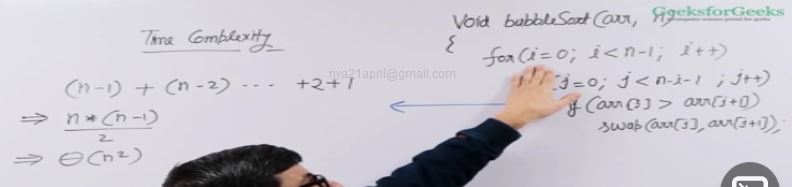

#### More optimized implementation

Can we optimize the sort such that if our array is sorted or our array becomes sorted in the middle it does not check further.

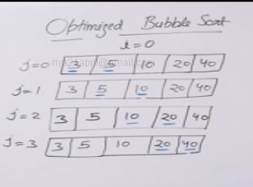

In this example we run the i =0 and we run the loop till j=3 for i=0 and we inialized a swapped variable before if no swap happens then it remains false and after the completion of jth loop we break.

##### Bubble sort is stable

## Selection Sort - Given array it finds the max element and after finding the max element then swaps the max element with the last element

#### Naive Implementation 

We use a temp array of same size for this like we find the 1st minimum then put it the first position of the temp array and replace the element in the original array with infinite.

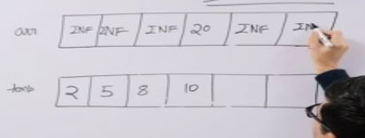

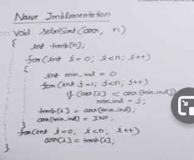

And in the end we copy the elements in the original array.

#### Better in place implementation

Given array it finds the mix element and after finding the mix element then swaps the mix element with the first element or the 2nd element provided how many iterations already done.

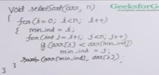

Changing n to n-1 

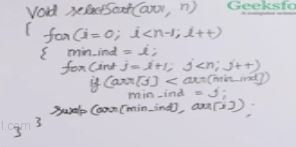

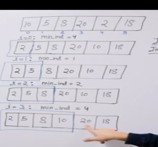

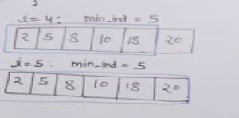

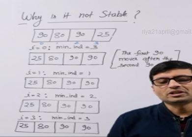

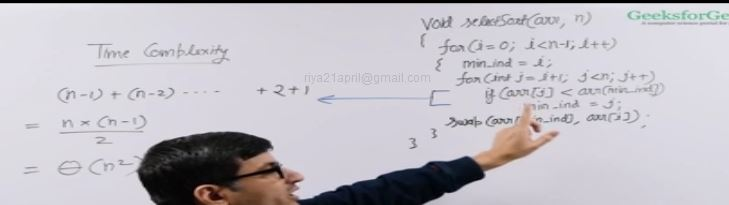

##### Selection sort not stable

## Insertion Sort