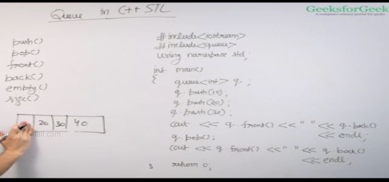
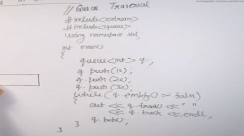
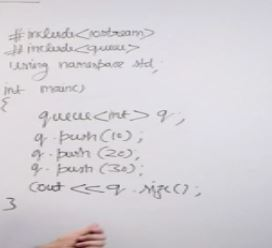
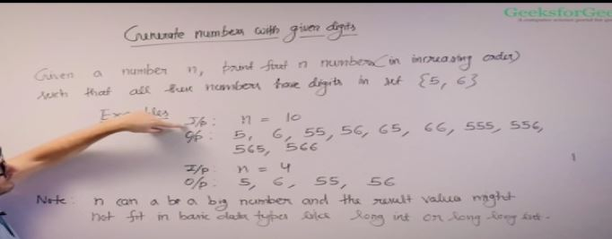
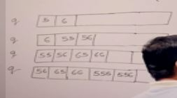
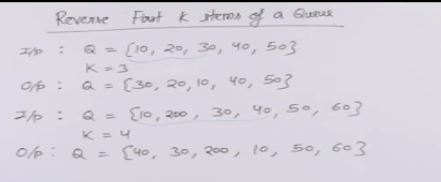
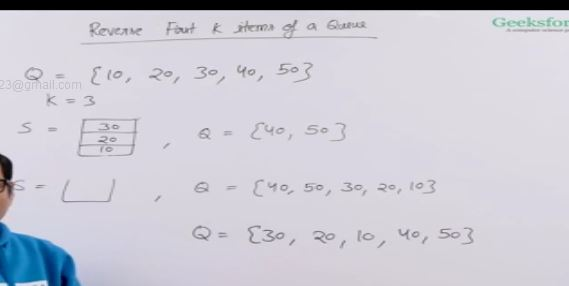
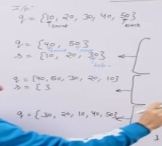

FIFO

All operations are in O(1)

this can be provided using list and dequeue

## Sample Problem : Generate numbers using given digits : O(n)

This is great !!

We insert 5 and 6 in the queue then each time we pop an element we append 5 and 6 in the popped element and insert it in the queue

## Reverse first K items in a Queue

Approach and implementation of reversing first k items in a queue are discussed.

We use a stack and a queue for this , first we put the first k into the stack then insert it in the queue hence the first k is reversed then the remaining element are popped and pushed one by one . For this question we are given the data in the form of a queue.

