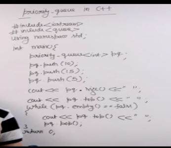

We use max heap by default

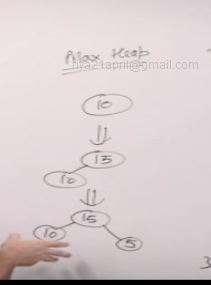

If we want min heap

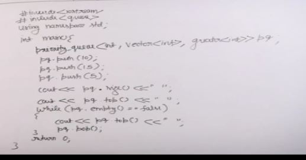

Priority queue uses heap but built in top of a vector.

Build priority queue from array this is better than push abd pop

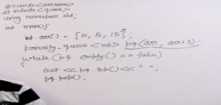

Min heap priority queue

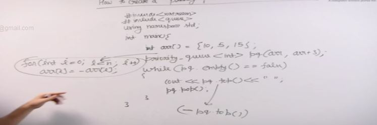

In priority queue of pairs element will be considered according to the first element of the queue.

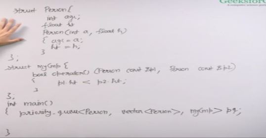

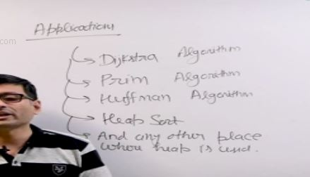

## Sort an array using priority_queue

Using Max heap

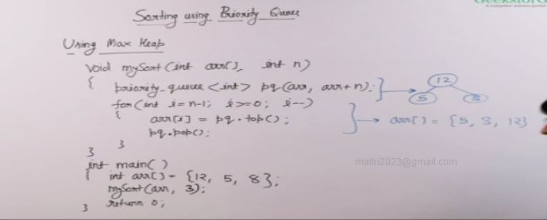

Using Min heap

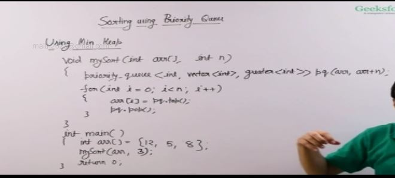 

Time Complexity - O(nlogn)

## K largest elements in an array

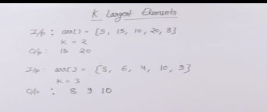

### Naive Solution
- Sort and print last k.
- O(nlogn+k)

### Better : Max Heap
- pop k items
- O(n + klogn)

### Efficient Solution: Min heap

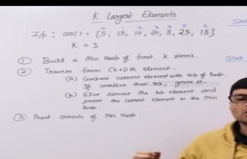

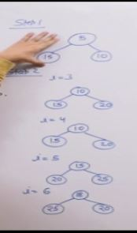

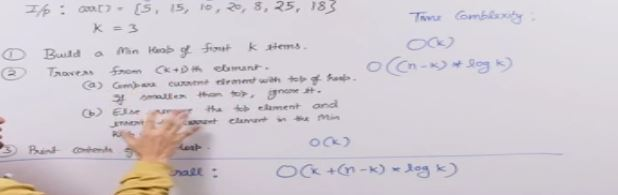

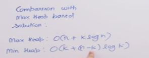

- Min heap better or Max heap better?
For k very small - 
- Min : O(n)                    Max : O(n + logn)
For k very large - 
- Min : O(n + logn)             Max : O(n + nlogn)

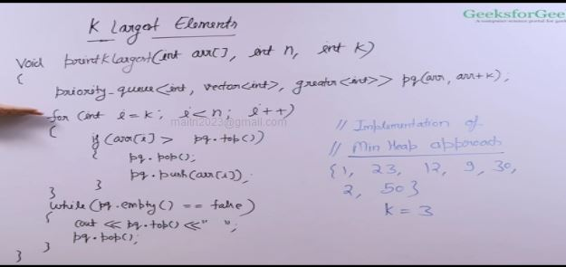

## Buy maximum items with given money

Given an array of prices of items, we need to find the maxium count of items that we can purchase with given money.

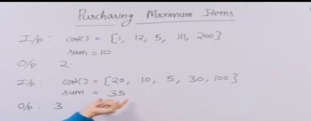

### Naive Solution

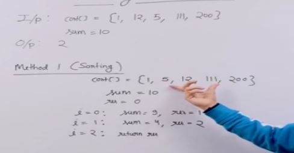

### Efficient Solution

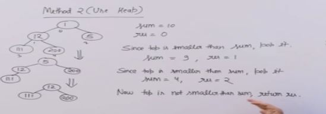

Time - O(n) + O(res*logn)

## Find K most frequent elements

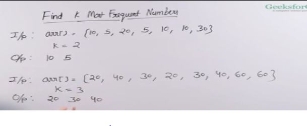

If items have same frequency give priority to the smaller element

### Naive Solution : Unordered map and vector : O(nlogn)

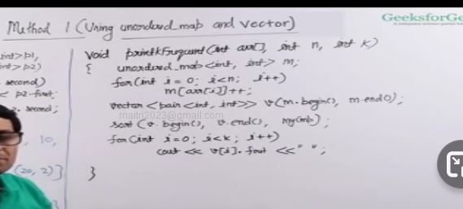

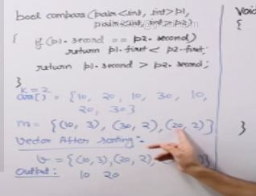

### Priority Queue based solution : O(klogn)

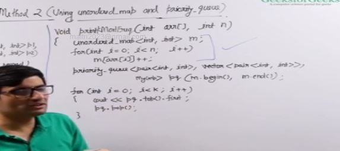

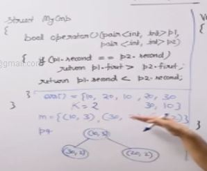

Note : Two things to note before writing mycomp function to priority queue
- In priority queue we need a struct / class type template to pass as argument whereas in sort we give a function type aregument.
- In priority queue the grreater then less then signs are reversed comapred to sort funtion . Its beacause we have to convert to min heap from a max heap type structure . I didn't get that point too :(

## K Most Frequent Elements in Linear Time

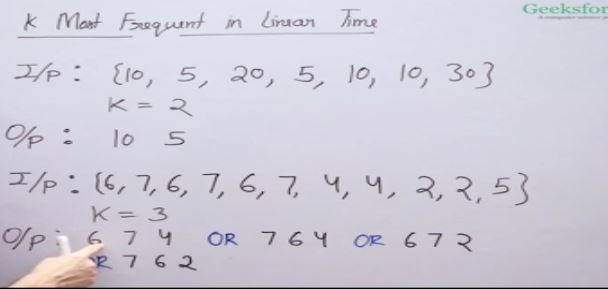

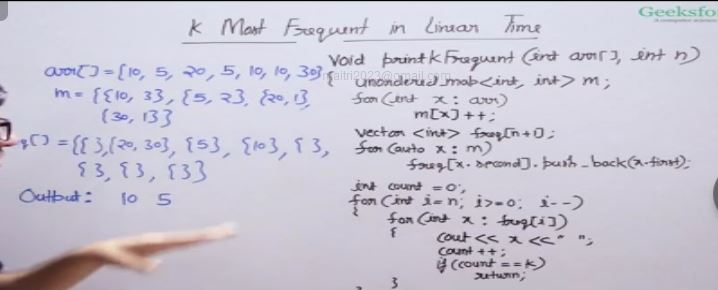

Handle ties like prints the element which appears first.

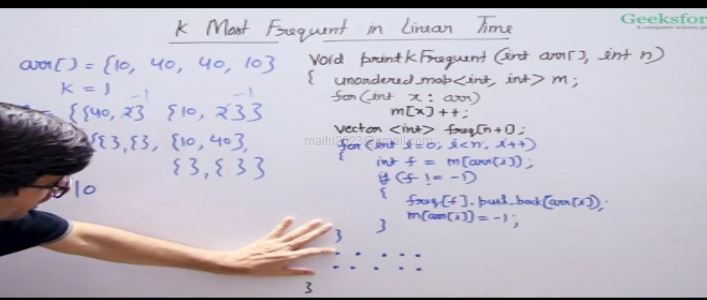

Space: O(n)