Set always inserts the elements in a sorted order.

This will be default be sorted in increasing order or ascending order.

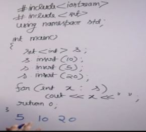

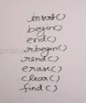

If want to sort in decreasing order

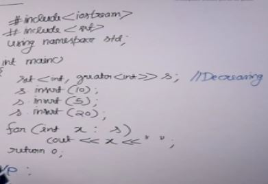

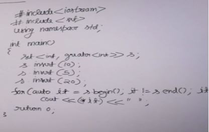

end points to the element beyonf=d the last element

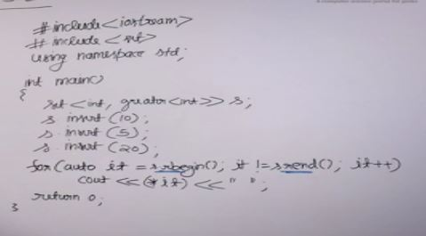

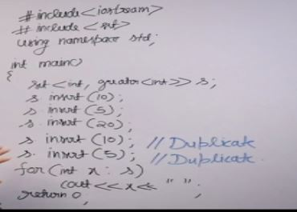

Set ignores duplicate values

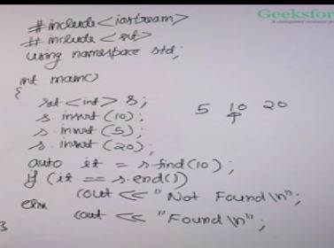

Find returns iterator to the element if present else returns end iterator.

clear removes all element s.clear()

s.count(<element>) returns 1 if exist else 0 though count always returns the frequency but in case of set as only unique elements are there so it returns 1.

s.erase(<element>) removes a element
Also takes iterator
s.erase(<iterator>)
s.erase(it,s.end()) -> removes all element between it and s.end() excluding s.end()

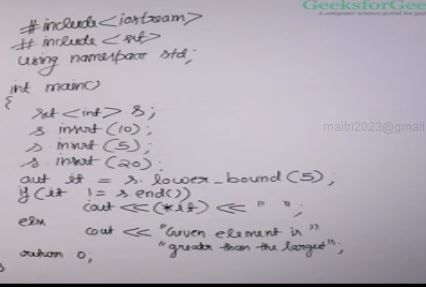

Lower bound method -
- if elem present returns the iterator to it
- else if not present and is smaller than the largest element in the set returns iterator to the element just greater than the passed element
- else returns end if the element is greater than the greatest element.

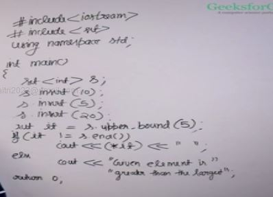

Upper bound method -
- if elem present returns the iterator to it next to the elem
- else if not present and is smaller than the largest element in the set returns iterator to the element just greater than the passed element
- else returns end if the element is greater than the greatest element.

Set is built on top of self belancing binary tree known as Red Black tree

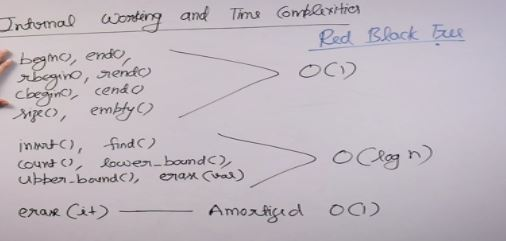

- Set for user defined data type

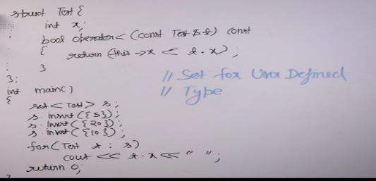

## Design a Data Structure that supports following operations

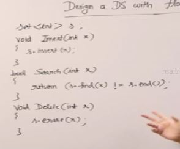

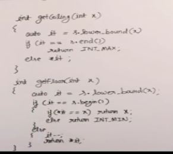

Iterators in set are bidirectional that is we can do it++ or it-- but these are not random access iterators so we can't do it+5 and all

## Ceiling on right

Given an array, we need to find ceiling of every element on right side of it.

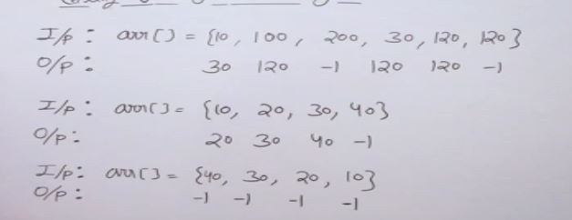

### Naive

traverse the array n^2

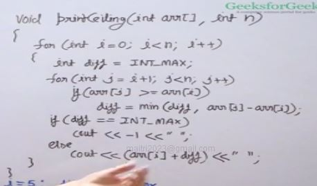

### Efficient Solution : O(nlogn), Space: O(n)

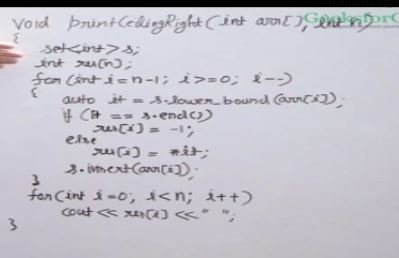

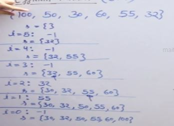

## Multiset

Set allows only one instance multiset allows multiple instances.

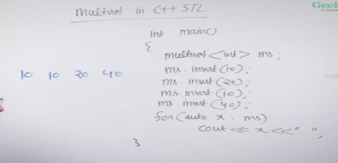

erase remains all instances of the value other forms are same as set

count returns frequency.

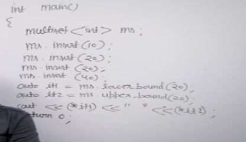

Research about this below

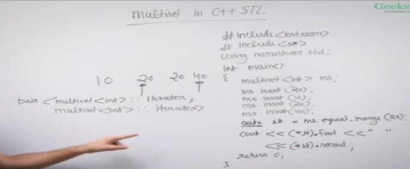