Mao is similar to a set in a way that both of them are built using red black tree

Difference is set only stores keys map on the other hand stores key value pairs

In map items are sorted in ascending order acc to the key

If key already present and we call a new insert with the same key then the key value pair is completely ignored.

m[<element>] -> if element is not present in the map it inserts the key with a default value of 0

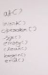

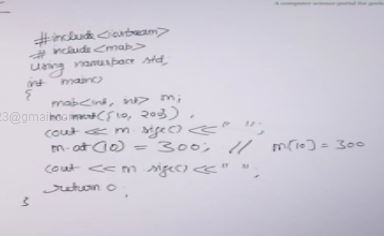

at operator does the same as the [] but it throws an exception if key is not present.

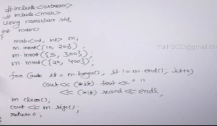

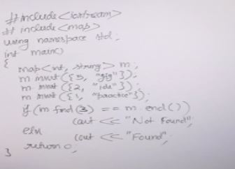

find returns the iterator to the key, it only takes key as input

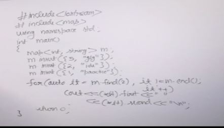

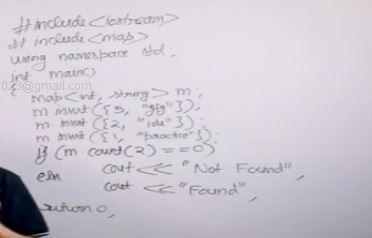

count in map returns 0 if key not present 1 if present

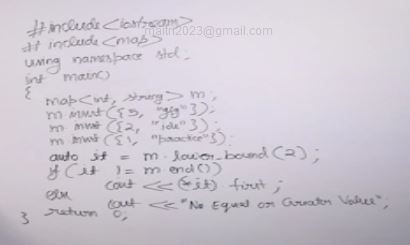

lowet bound works same as set takes key input

upper bound same as set

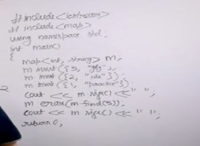

erase works same as all other stl

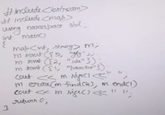

## Design a Data Structure for Item Prices

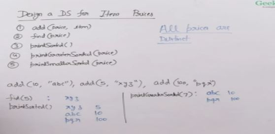

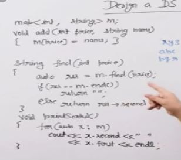

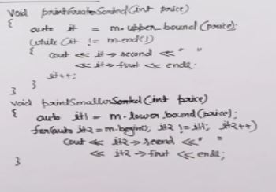

## Count Greater Elements for every Array Element

Given an array of integers, we need to count greater elements for every array element.

### Naive Soln : O(n^2)

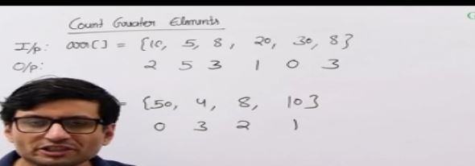

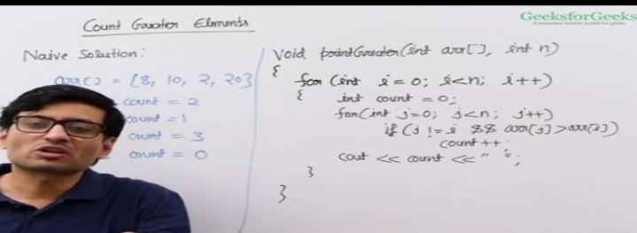

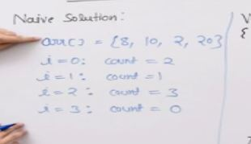

### Efficient Solution : O(nlogn)

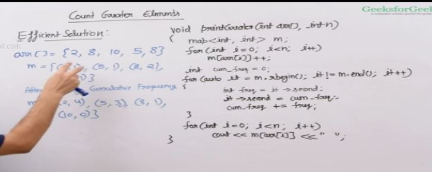

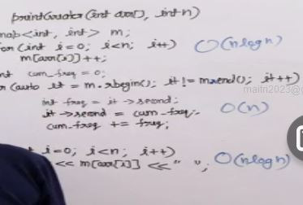

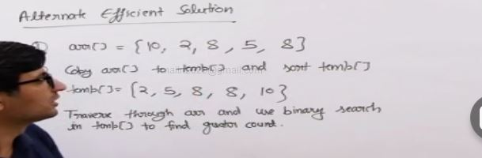

## Multimap in C++ STL

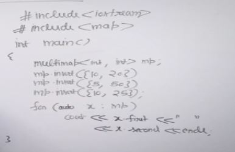

Same as map but can store multiple keys with same values.

we can't use m[10] = 11 in multimap because there are multiple key of the same magnitude.

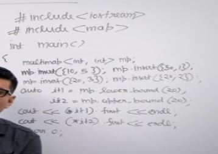

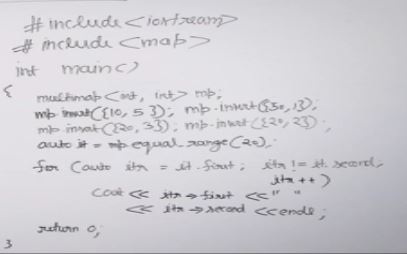

equal range function returns a pair of iterators of multimap type, the first iterator returns lower bound and the second iterator returns upper bound . Then we traverse using this two iterators and get all the same elements with same keys.

## Design a DS for Prices with Duplicates allowed

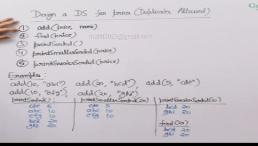

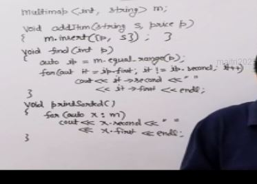

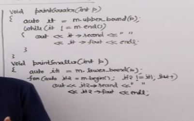