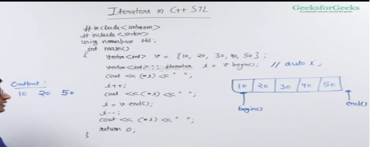
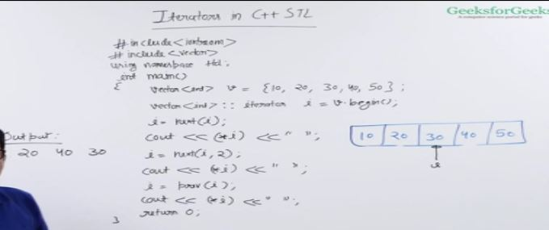
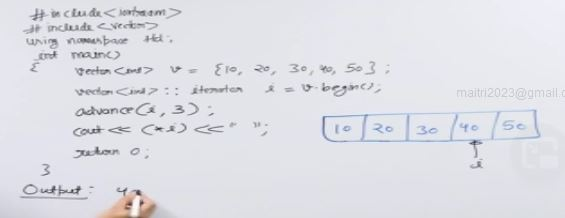

- iterator gives address of an element in c++

- iterators are not pointers there are some iterators that can be treated as pointers but many iterators can't be treated like pointers for example forward list iterator.

## begin and end

- end() iterator points to the memory location just next to the last element

## next and prev

- next gives iterator the number of iterators after the current iterator , if we do not give any second iterator it gives the immediate iterator
- prev is same as next just gives the prev element

## advance
- same as next only diff is next returns an iterator advance modifies the same iterator.

## types od iterators
- 5 types of iterators
    - input - only read data and can move ahead only
    - output - only write data 
    - forward - can input and output but can only move forward
    - bidirectional - input,output,forward and can move backward
    - random - input,output,forward,bidirectional and can do many more like compare

advance function cannot take negative second parameter if its a forward iterator.