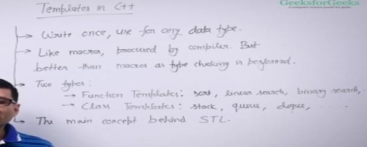
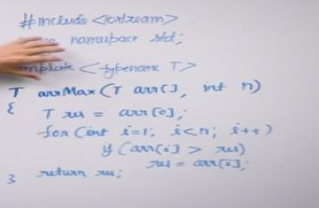
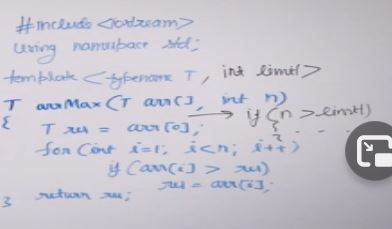
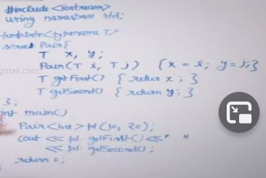
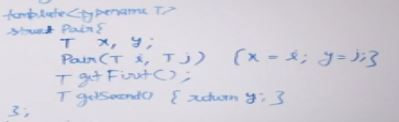

Templates can be used for any data types

## diff between macro and template

- macro's are preprossesing phase in computer and whenever compiler finds a macro it replaces the lhs expression with rhs expression

- problem with macro is that it does not do typechecking
- another problem is that its error prone because its simple search and replace
- its difficult to debug

- templates are much better it typechecks and less error prone because its like a function call

## Function Templates
Idea behind this is write the function once and generate the functionality for different data types

when we call the function using a data type T is replaced by that datatype

Always a good practice to give the integer type to function call

Sometimes we want to give same limit to the array size so what we can do is 

we can throw exception in the if statement

we can pass non data type value too like int but they should be const type

For example -
- int n=100; and then passing n will give error.
- const int n=100; now passing n will not give error.

## Class templates

can use both struct and class , diff is struct makes all variables public .

we can also define class or struct function outside the class

