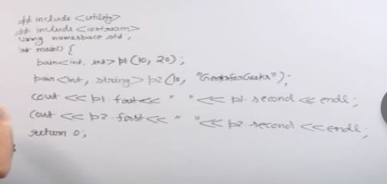
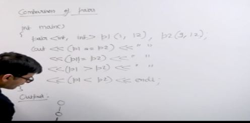
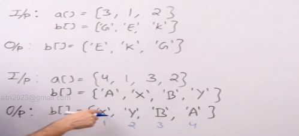
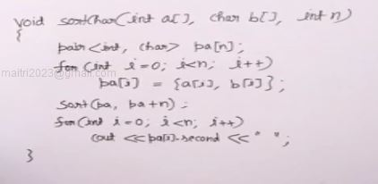

```
pair = {first element, seconf element}
```



- if we do not initialize pair initializes as (0,0)
- can also be done as p1 = {10,20}
- also can use p1 = make_pair(10,20)
- pair<int,string>p2(10,"Grandfather")



- ' == ' ->returns true if both elem in pair are equal
- ' != ' ->return true if any of the element is not equal
- ' > ' -> compares first element in both pairs and returns true if first element in p1 is greater than first element in p2, if first values is same then compare the second value
- ' < ' -> compares first element in both pairs and returns true if first element in p1 is less than first element in p2, if first values is same then compare the second value

## Sort an array according to the other 

So given an character array and an int array we have to sort the char array according to the int array



we can use pairs to sort the array , for example we can make pair array of (int arr[i],char arr[i]) then sort this will sort the array wrt the int arr[i]



we can also use vector of pairs instead of array of pairs

- we can also write
    - pa[i].first = a[i]
    - pa[i].second = b[i]

Time complexity - 
copying - O(n)
sorting - O(nlogn)
printing - O(n)
total - O(2n + nlogn)
so complexity - O(nlogn)