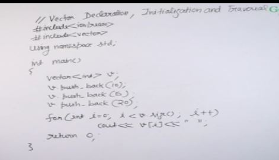
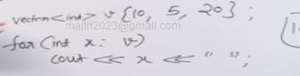
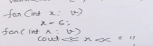
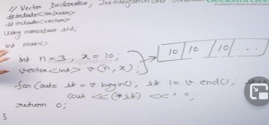
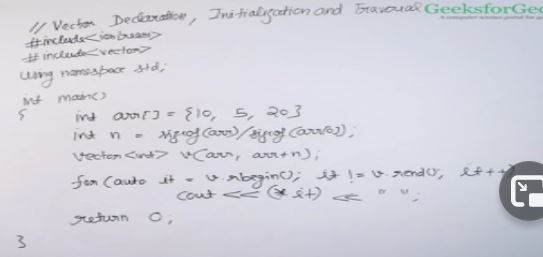
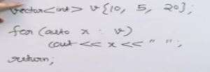
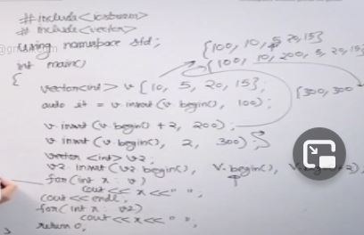
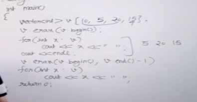
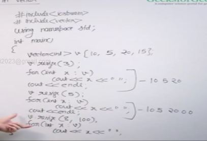

## Why vectors not array?
Vector Advantages
- Dynamic size
- Rich Library Function
    - find
    - erase
    - insert
- Easy to know size
- No need to pass size when passing to function
- can be returned from a function
- by default initialized with default values
    - int ->0
    - bool ->false
- we can copy a vector to other 
    - v1 = v2

## Vector Declaration


- v[i] -> does not check array index out of bound and hence will crash at runtime
- v at (i) -> this checks out of bound

both are vector accessing syntax

- v[i] = 5; valid

Another way to print vector elements



one thing to note is if we do x=6 inside the loop in the above picture the vector will not change , to change the vector we have to do-





creates a vector of size 3 with all the elements of value 10


iterator of a vector

*it gives value



prints reverse of the array
rbegin points to the last element
rend points the the -1 th element that is element left next to 0th element

we can also do
```
vector<int> v{1,2,3};
vector<int> v1(v.begin(), v,end());
```

if we need to traverse a vector the least we have to write in



## More Functions in Vectors
These functions can be accessed using dot eg...., v.front()
- pop_back() -> used to remove the last element of the vector
- front() -> returns reference to the first element of the vector , we can change element value using front ..., v.front() = 100
- back() -> returns refernce to the last element of the vector, we can change element value using back ..., v.back() = 100
- insert() -> inserts at a specified position and returns an iterator

- insert continued   
    - inserts 200 in v.begin()+2 position
    - inserts 2 300 in v.begin() position
    - inserts in v2 in position v2.begin() all elements from vector v.begin() to v.begin() +2 last position is excluded like only two elements will be inserted
- erase() -> removes from a position


last erase statement removes elements from 10 to 20 that is 10,5,20
- clear() -> removes all element from the vector , we use clear if there are multiple test cases , we clear the vector in new test case and reuse the vector
- resize() -> resized the vector removes elements if sized smaller , if sized bigger than fills the remaining values with default value from example if int then 0, we can also specify value for the new elements

- empty() -> returns true if the vector is empty