# Forward_List

- Forward list mainly implements a singly linked list.
- There is a list which implements doubly linked lists.

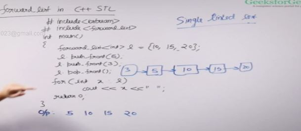


- assign assigns a set of values to a linked list.
- remove removes all instances of the value given to it. 
- auto saves us from writing the iterator declaration

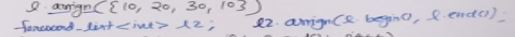
- assigns all the values of one linked list to the other

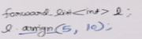
- assings a value of 10 to 5 elements in forward list.

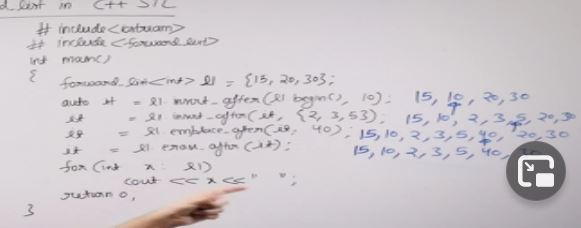
- insert after and emplace after are same but emplace after do some optimisation for large objects kind of, they inserts the element from the respective position and returns the iterator of the last element inserted.
- erase after erases the next element to the iterator provided. and returns the iterator of the next element to the deleted element
- arrow represents the position of iterator.
- erase element can take 2 parameters too
```
l.erase(it,l.end())
```

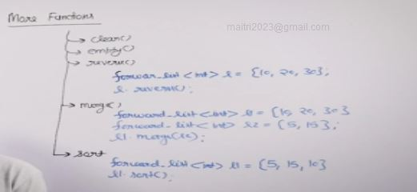
- clear - clears the content of the forward list.
- empty - it returns true if the forward list is empty else false.
- reverse - reverses the the list.
- merge - merge function assumes two sorted list and merges the first list into the second sorted and the second list becomes empty.
- sort - sorts the list.
can sort in reverse by passing greater or customized function.

## Time Complexities
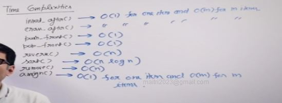

# List
- list is doubly linked list
- in forward list we can only do push_front but in list we can do both push front and back.

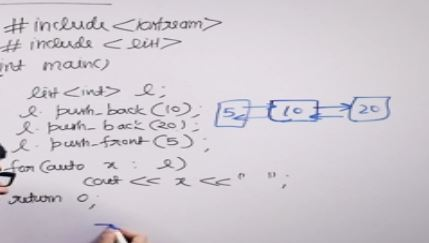

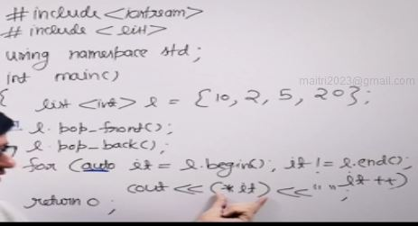

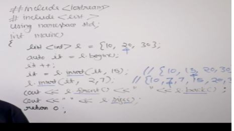
- first insert just inserts 15 at the position given.
- second insert inserts the 7 in the position 2 times
- front function returns the first element
- back function returns the last element
- size function gives size

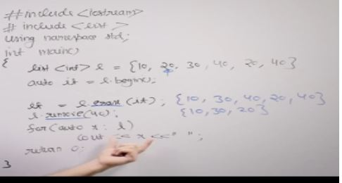
- erase erases the elemnt next to the element it is pointing at and returns the it to the next element
- remove - removes all occurances of the value in the list
for example all occurance of 40 is removed

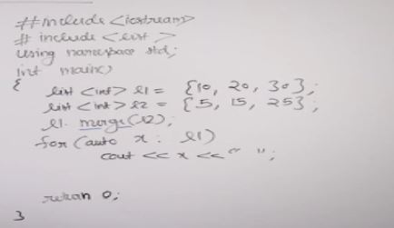
- merge used to merge two sorted list

## Time Complexities
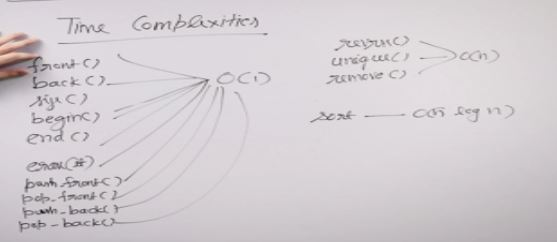

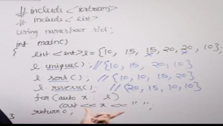
- unique removes consecutive same elements in a list

## Sample Problem: Josephus Problem using List in STL
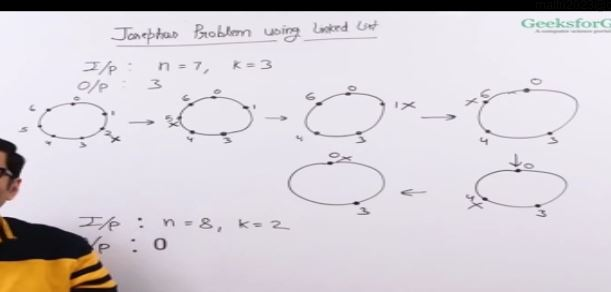

Idea is to used a circular linkedlist

In c++ we don't have a circular linked list so we make the list class behave like a circular linked list we move the iterator to the begin when we get to the end

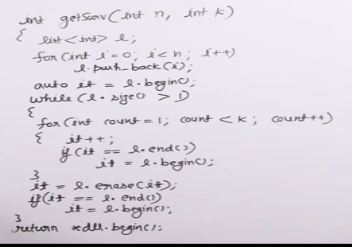