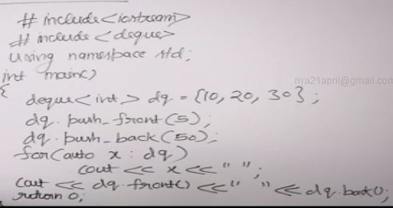
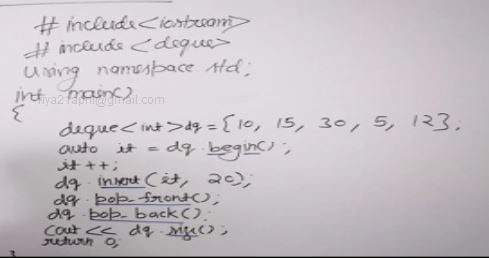
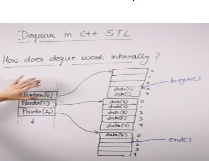
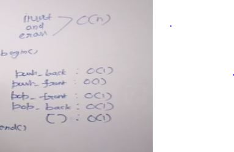
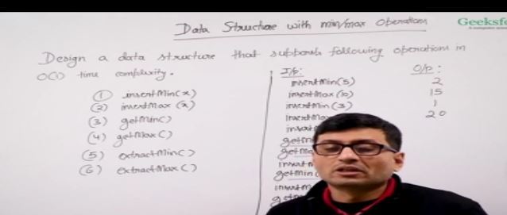
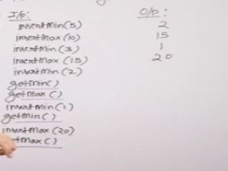
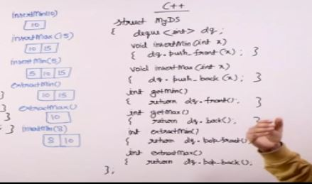
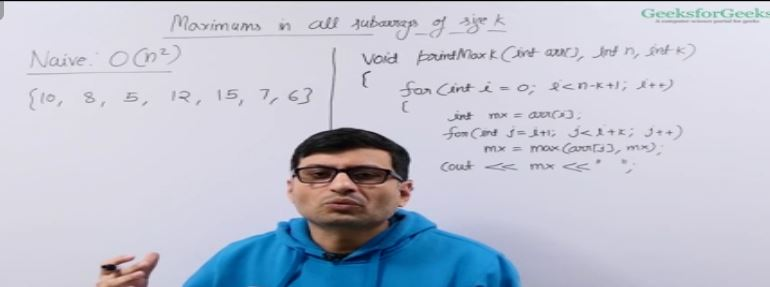
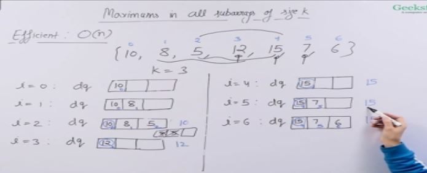
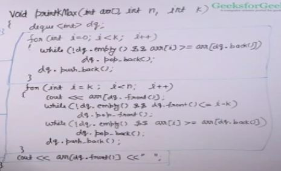

## Deque in c++ stl

- begin returns pointer to the first element and end beyond the last element
- cbegin and cend are const iterators can't change any element using this iterators
- rbegin and rend are reverse iterators , rbegin points to the last element and rend points to the element just before the first element.
- crbegin and crend const version of rbegin and rend
- insert inserts the element before the iterator.
- size how many elements in deque
- constant time means that the time is constant wrt to the copy constructor calls

## Design a Data Structure with Min and Max operations

Constraint we only insert anything anything which is greater than max and smaller than min.The element should be eiyher greater than all the elements or smaller than all the elements.

We can do it using deque maintaining min at the front end and max at the rear end.

## Sample Problem : Sliding Window Maximum

Given an array and a number k, we need to find maximum element in every window of size k.

The idea is that we maintain a size of deque as k and store the max element in front of the deque , note that in deque all operattions are O(1)

Note array is sorted

If the array was sorted in increasing order than ourt approach would've been to remove all elements from the deques if a larger element is found.

Here in this example we have a array sorted in decreasing order.

We need ro keep the smaller elements that come after greater element but when we see a greater element after smaller element we can remove all the smaller elements.

Time Complexity O(n)