## Stack traversal

stack is traversed reverse the order we insert the items.

stack by default using deque

stack is container adapter because its implemented in top of other container.

## Sample Problem: Reverse Items using Stack

### string

Reverse items using stack
We can do it but its not the best way to do it because we can reverse it without using auxillary space.

### can use it in forward list

We can take the item from forward list one by one and put them in a stack then take from stack to put them in a forward list.

if the q was that find odd items and print in reverse then we can use this shown in the above image

## Sample Problem: Balanced Parenthesis

This video talks about the most popular application of stack, balanced paranthesis.

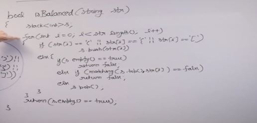

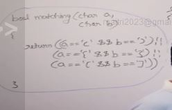

## Sample Problem - Stock Span Problem

Stock span problem

Span is how many contiguous elements before the element in question has smaller or equall value.

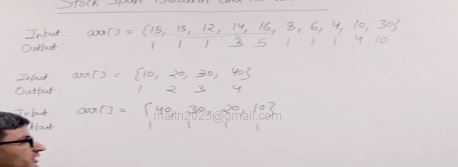

### Naive soln: O(n^2)

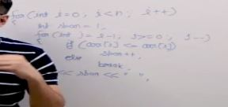

The idea is simple for every element we traverse on left of it and while we are traversing we break the loop if we find a greater element.

### Efficient solution using stack: time:O(2n), space:O(n)

because for every element in stack it el=xactly goes ones inside the stack and comes out ones so its O(n) tho it looks like O(n^2) in first look.

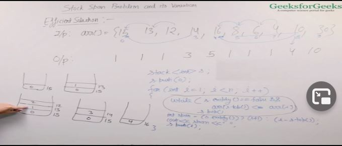

Idea of the approach canbe better understood with the dry run.
So basically we enter elements in the stack in decreasing order greatest before then smallest but if a greater elements comes we remove all the smaller element then the current element.

## Sample Problem - Previous Greater Element

This video talks about a simple variation of stock span, previous greater element

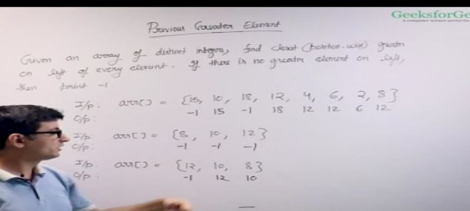

### Naive Soln : O(n^2)

### Efficient soln : O(n) in worst case O(2n)

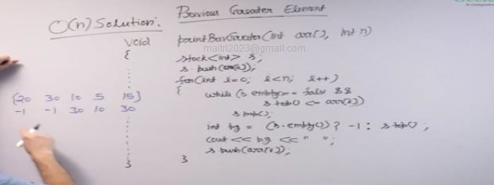

cout<<-1; for the first element not given in the solution.

## Sample Problem - Next Greater Element

This video talks about popular interview question "Next Greater Element"

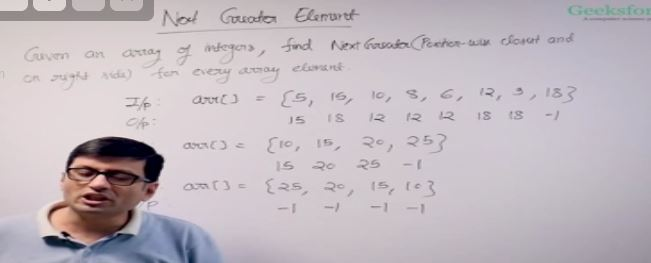

### Naive Solution 

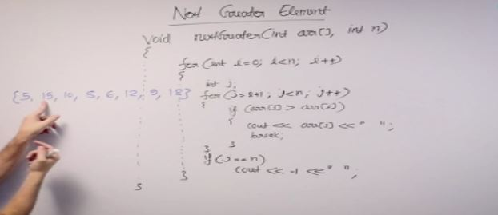

### Efficient Solution: O(n)

Its the same as previous element one just we traverse the array from the right side. or from the end/

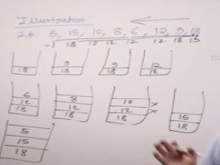

we can use a vector and print it reverse.

## Sample Problem: Design a Stack that supports getMin() operation

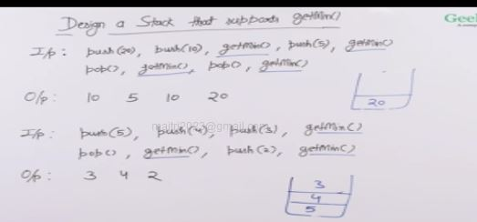

Maintain an auxillary stack

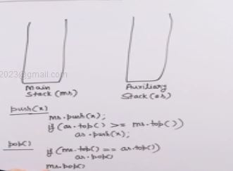

we also have to push equal items in the auxillary stack