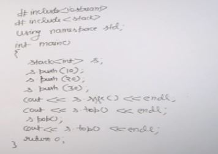
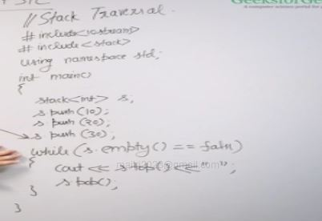
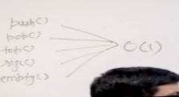
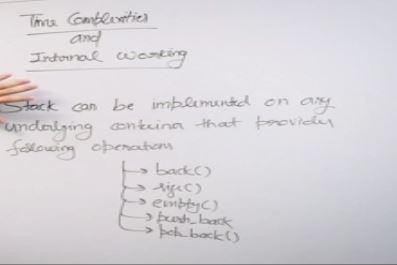
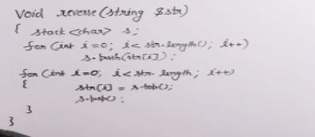
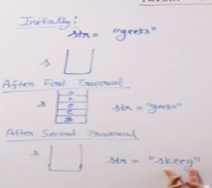
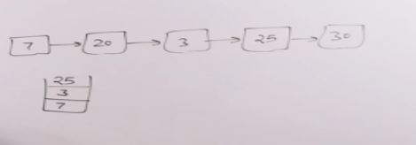
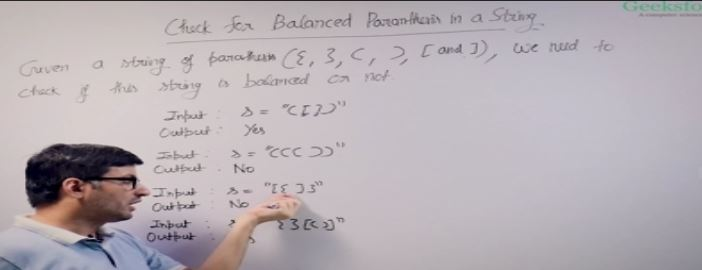

## Stack traversal

stack is traversed reverse the order we insert the items.

stack by default using deque

stack is container adapter because its implemented in top of other container.

## Sample Problem: Reverse Items using Stack

### string

Reverse items using stack
We can do it but its not the best way to do it because we can reverse it without using auxillary space.

### can use it in forward list

We can take the item from forward list one by one and put them in a stack then take from stack to put them in a forward list.

if the q was that find odd items and print in reverse then we can use this shown in the above image

## Sample Problem: Balanced Parenthesis

This video talks about the most popular application of stack, balanced paranthesis.

